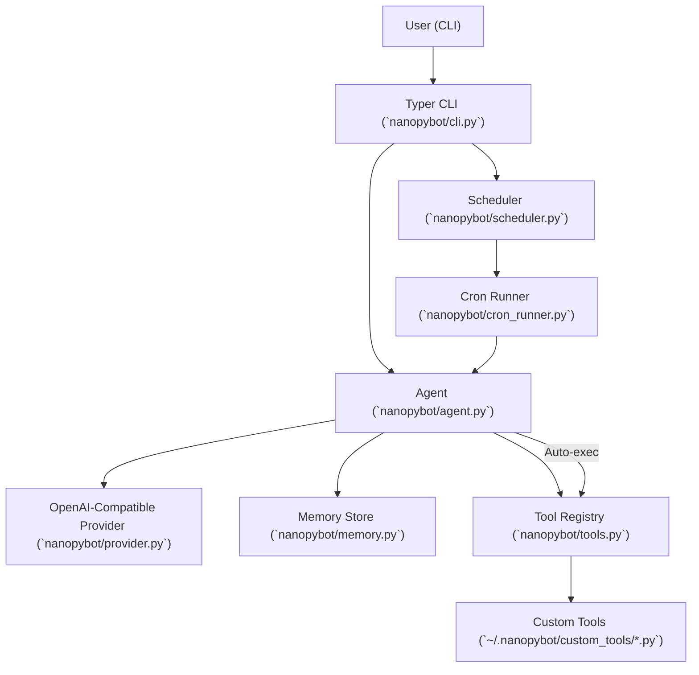
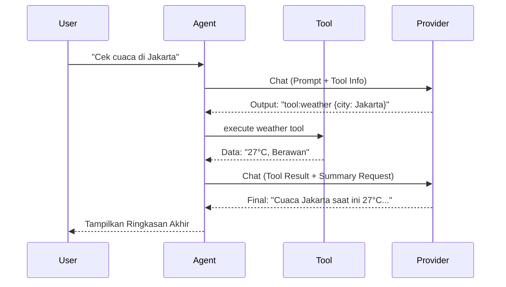
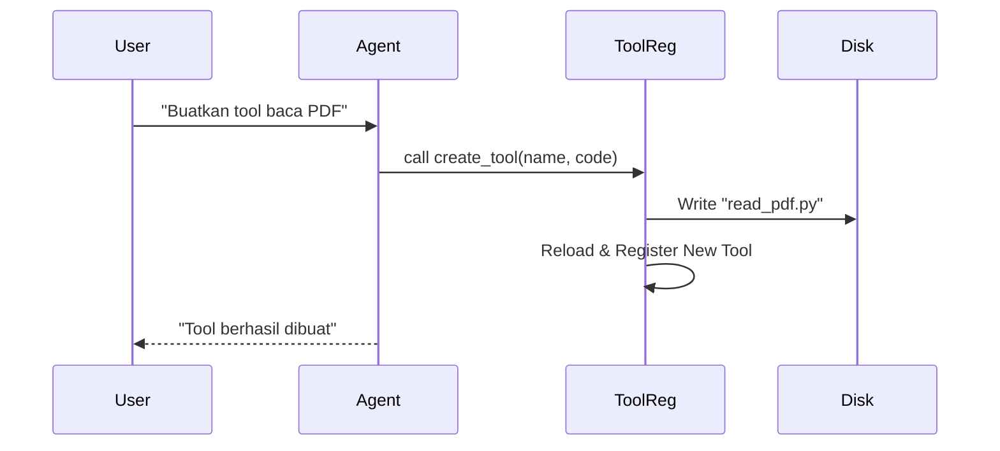

# Architecture Overview

Dokumen ini menjelaskan arsitektur aplikasi `nanopybot` berdasarkan implementasi terbaru yang mendukung *Self-Learning* dan *Dynamic Tooling*.

## System Context

## Core Components

- `nanopybot/cli.py`
  - Entry point utama perintah `nanopy`.
  - Menginisialisasi `Agent` dengan menyuntikkan konfigurasi dan path tool kustom.

- `nanopybot/config.py`
  - Menangani pemuatan konfigurasi dari `config.json` lokal atau `~/.nanopybot/config.json`.
  - Menyimpan kunci API (OpenAI, Serper), path memori, dan path tool kustom.

- `nanopybot/agent.py`
  - **Orkestrator Cerdas**: Mengelola alur percakapan dan deteksi feedback.
  - **Auto-Summarization**: Jika AI memanggil tool, Agent akan mengeksekusi tool tersebut, mengirim hasilnya kembali ke AI, dan memberikan ringkasan akhir kepada user.
  - Mengelola memori aturan (`rules.list`) yang disuntikkan ke dalam *System Prompt*.

- `nanopybot/tools.py`
  - **Dynamic Registry**: Memuat tool bawaan dan tool kustom dari disk secara dinamis.
  - **Tool Injection**: Menyuntikkan objek konfigurasi ke dalam fungsi tool sehingga tool kustom bisa mengakses API key atau setting lainnya.
  - **`create_tool`**: Tool bawaan yang memungkinkan AI menulis file Python baru ke disk untuk menambah kemampuannya sendiri.

- `nanopybot/provider.py`
  - Terhubung ke API OpenAI-compatible.

- `nanopybot/memory.py`
  - Penyimpanan KV berbasis JSON untuk preferensi user.

## Runtime Flows

### 1) Chat & Auto-Summarize Flow
Alur ketika AI menggunakan tool dan merangkum hasilnya.

### 2) Dynamic Tool Creation
Alur ketika AI membuat kemampuan baru.

## Data & Storage

- **Config**: `~/.nanopybot/config.json` (Setting API & Path)
- **Memory**: `~/.nanopybot/memory.json` (Aturan Self-Learning)
- **Jobs**: `~/.nanopybot/jobs.sqlite` (Jadwal Cron)
- **Custom Tools**: `~/.nanopybot/custom_tools/` (Script Python buatan AI)

## Current Architectural Characteristics

- **Extensible**: Bot bisa belajar dan menambah fiturnya sendiri tanpa modifikasi kode inti.
- **Stateful**: Memiliki memori jangka panjang untuk preferensi user.
- **Resilient**: Jadwal tugas (Cron) tetap aman di SQLite meskipun sistem restart.
- **Context Aware**: Tool memiliki akses ke konfigurasi global melalui injeksi objek config.
- **Interactive**: Mendukung feedback loop di mana hasil tool diproses kembali oleh AI untuk kemudahan user.
