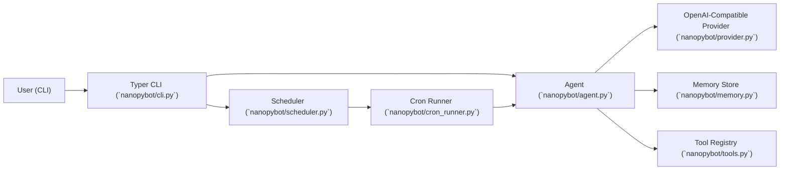
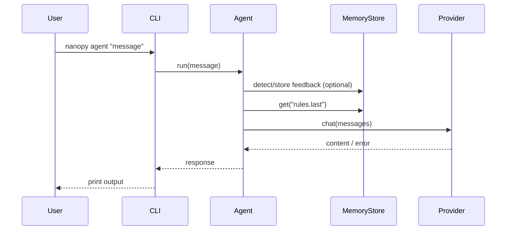
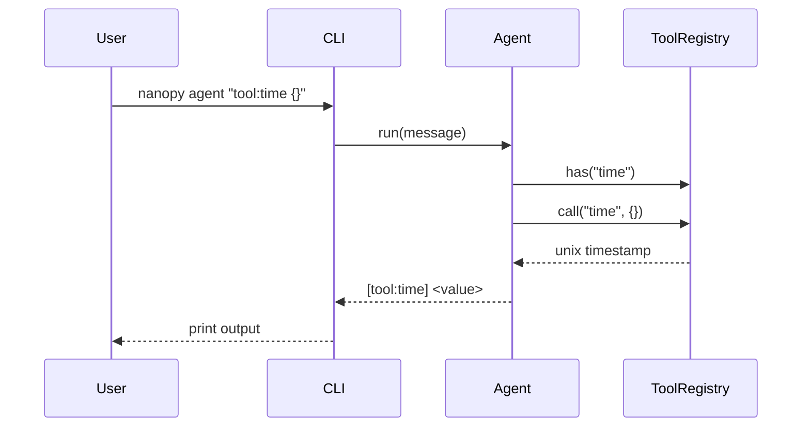
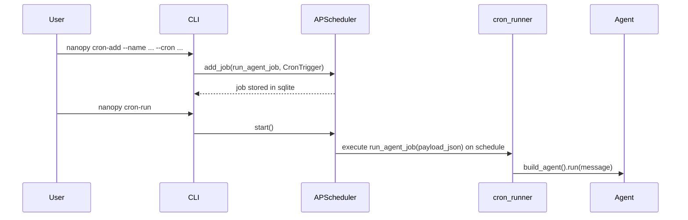

# Architecture Overview

Dokumen ini menjelaskan arsitektur aplikasi `nanopybot_selflearn_cron` berdasarkan implementasi saat ini.

## System Context

## Core Components

- `nanopybot/cli.py`
  - Entry point command `nanopy`.
  - Menyediakan command:
    - `agent <message>`
    - `cron-add --name --message --cron`
    - `cron-run`
  - Menangani error provider (`ProviderError`) untuk command `agent`.

- `nanopybot/config.py`
  - Load dan bootstrap konfigurasi dari `~/.nanopybot/config.json`.
  - Menyimpan konfigurasi provider (`api_key`, `base_url`, `model`), memory path, scheduler db path.

- `nanopybot/agent.py`
  - Orkestrator utama request.
  - Deteksi feedback user via `detect_feedback`.
  - Simpan feedback terakhir ke memory key `rules.last`.
  - Menyuntikkan `rules.last` ke system prompt untuk request selanjutnya.
  - Menangani jalur tool call lokal dengan format pesan `tool:<name> <json_args>`.

- `nanopybot/provider.py`
  - Adapter HTTP ke endpoint OpenAI-compatible `/chat/completions`.
  - Input: list `ChatMessage`.
  - Output: `choices[0].message.content`.
  - Error handling:
    - HTTP status error -> `ProviderError` dengan detail response.
    - Network/request error -> `ProviderError`.
    - Response format invalid -> `ProviderError`.

- `nanopybot/memory.py`
  - KV store berbasis file JSON.
  - Operasi utama: `get`, `put`, `delete`, `keys`.
  - Persistence ke file pada setiap update.

- `nanopybot/tools.py`
  - Registry tool sederhana (`register`, `has`, `call`).
  - Tool default saat ini:
    - `time`: mengembalikan Unix timestamp.

- `nanopybot/scheduler.py`
  - Inisialisasi `APScheduler` dengan `SQLAlchemyJobStore` (SQLite).
  - Parser cron expression 5 field (`minute hour day month day_of_week`) + validasi format.

- `nanopybot/cron_runner.py`
  - Job function untuk scheduler.
  - Membaca payload JSON, lalu menjalankan agent secara async (`asyncio.run`).

## Runtime Flows

### 1) Direct Chat Flow (`nanopy agent "..."`)

### 2) Tool Call Flow (`nanopy agent 'tool:time {}'`)

### 3) Scheduled Flow (`nanopy cron-add` + `nanopy cron-run`)

## Data & Storage

- Config: `~/.nanopybot/config.json`
- Memory: `~/.nanopybot/memory.json`
- Scheduler job store: `~/.nanopybot/jobs.sqlite`

## Current Architectural Characteristics

- Sederhana, file-based persistence, mudah dijalankan lokal.
- Provider terpisah sebagai adapter, memudahkan ganti backend kompatibel OpenAI.
- Scheduler persisten via SQLite (job tetap ada setelah restart proses).
- Tool-calling masih berbasis parsing string sederhana (belum function-calling native model).
- Memory belum punya rotasi/TTL/locking; cocok untuk skala kecil/single-process.
